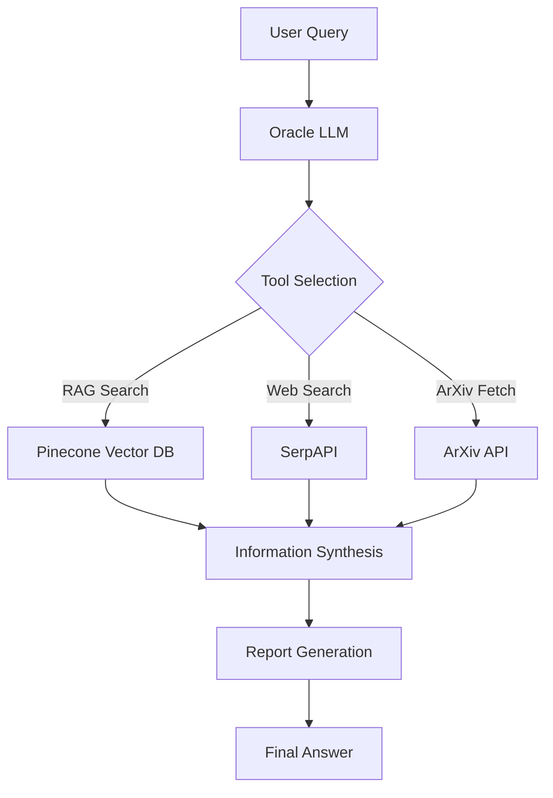

# 🧠 Genius LangGraph: Advanced AI Research Agent

## Table of Contents
- [🌟 Introduction](#introduction)
- [🚀 Features](#features)
- [🛠️ Technologies Used](#technologies-used)
- [📊 Project Structure](#project-structure)
- [🔍 How It Works](#how-it-works)
- [🖥️ Installation](#installation)
- [🎮 Usage](#usage)
- [📚 Skills Learned](#skills-learned)
- [🔬 Future Improvements](#future-improvements)

## 🌟 Introduction

**Genius LangGraph** is a powerful AI agent designed for in-depth research and automated report generation. It leverages multiple tools like web search, academic paper retrieval, and vector search to gather and synthesize information on complex topics.

This project demonstrates the use of **LangGraph**, a framework for building stateful, multi-step AI applications. By integrating LangChain, Retrieval-Augmented Generation (RAG), and knowledge bases like arXiv and Pinecone, this agent can autonomously navigate complex topics and produce coherent, structured reports.

## 🚀 Features

- 🔍 **Multi-source Research**: Combines information from arXiv, web search, and vector-based knowledge bases  
- 🧠 **Intelligent Decision Making**: Uses an Oracle LLM to determine the most suitable research tools  
- 🔄 **Dynamic Tool Selection**: Selects and executes tools based on context and task  
- 📄 **Comprehensive Report Generation**: Outputs detailed reports with introduction, methodology, findings, and references  
- 🧵 **Stateful Conversations**: Maintains context throughout the research process  
- 📈 **Graph-based Workflow Visualization**: Visualizes the agent's decision flow using Graphviz

## 🛠️ Technologies Used

- **LangGraph** – For building the multi-step, stateful research agent  
- **LangChain** – LLM orchestration and tool integration  
- **OpenAI GPT** – For language understanding and decision-making  
- **Pinecone** – Vector similarity search for RAG-based knowledge retrieval  
- **SerpAPI** – Live web search integration  
- **arXiv API** – Fetching scientific paper abstracts  
- **Sentence Transformers** – Generating high-quality text embeddings  
- **Graphviz** – Workflow visualization  
- **Python Libraries** – `requests`, `re`, `typing`, `operator`

## 📊 Project Structure



## 🔍 How It Works

1. **User Query**: The user submits a research prompt.
2. **Oracle Decision**: The Oracle LLM analyzes the input and selects the most appropriate tool.
3. **Tool Execution**: One of the following is executed:
   - **RAG Search**: Retrieves relevant documents using Pinecone.
   - **Web Search**: Performs Google search using SerpAPI.
   - **arXiv Fetch**: Pulls academic abstracts from arXiv.
4. **Iterative Research**: The system gathers information in steps.
5. **Synthesis & Reporting**: Combines findings into a structured report.
6. **Final Output**: Presents a well-structured report including all research steps and sources.

## 🖥️ Installation

```bash
# 1. Clone the repository
git clone https://github.com/yourusername/Genius-LangGraph.git
cd Genius-LangGraph

# 2. Install dependencies
pip install -r requirements.txt

# 3. Set up environment variables
export OPENAI_API_KEY="your_openai_api_key"
export PINECONE_API_KEY="your_pinecone_api_key"
export SERPAPI_API_KEY="your_serpapi_api_key"
```

## 🎮 Usage

1. Launch the Jupyter Notebook:
   ```bash
   jupyter notebook Genius LangGraph.ipynb
   ```

2. Run all cells to initialize the agent and supporting tools.

3. Submit a query using:
   ```python
   out = runnable.invoke({
       "input": "What are the latest advancements in quantum computing?",
       "chat_history": []
   })

   print(build_report(output=out["intermediate_steps"][-1].tool_input))
   ```

## 📚 Skills Learned

- Building **stateful AI agents** using LangGraph  
- Designing workflows with **LangChain and multiple tools**  
- Integrating multiple APIs and vector databases  
- Applying advanced prompt engineering for decision making  
- Visualizing agent logic with Graphviz  
- Developing RAG-based systems  
- Handling asynchronous AI workflows

## 🔬 Future Improvements

- Implement a user feedback loop for adaptive learning  
- Add support for more specialized data domains  
- Integrate data visualizations within the reports  
- Introduce caching and efficiency improvements  
- Develop a web interface for user-friendly interaction
